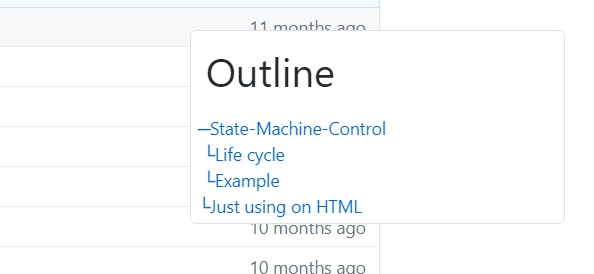

# Outline Reader

## Install

[Install Path](https://greasyfork.org/zh-TW/scripts/393572-github-outline-github-com)

## What is this?

This script provider a floating ui which can help user navigate the outline of the README document more efficiency.

Current script is only support github readme page

